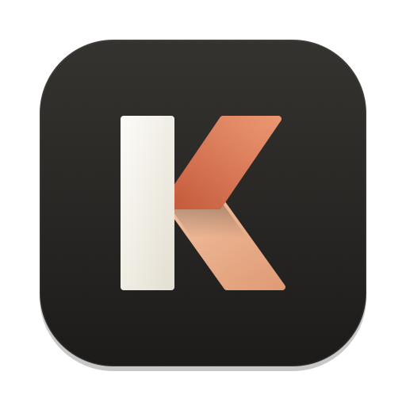
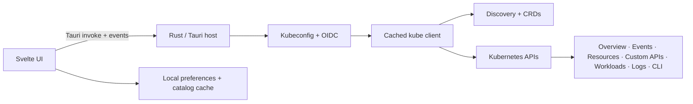

  

<h1 align="center">Kuberniva</h1>

  <strong>Kubernetes, in focus.</strong> 
  A fast, native desktop workspace for people who operate many Kubernetes clusters.

  
  
  
  
  

Kuberniva is an open-source, local-first Kubernetes desktop app. It opens instantly, keeps cluster switching quick, and puts the information that matters (health, workloads, resources, events, logs, and safe operations) into one focused workspace.

## ✨ Highlights

| | What you can do |
| --- | --- |
| ⚡ **Fast launch** | Opens straight to your last workspace with no network wait. Clusters you have opened before appear instantly from a local catalog cache and refresh in the background. |
| 🔌 **Connection recovery** | Live lists keep streaming while the window is in the background. After the Mac sleeps, Kuberniva quietly resumes every live view where it left off; it only asks you to reconnect when a connection actually fails. Stalled reads time out with a retry action, and open editors stay intact. |
| 🗂️ **Clusters** | Add kubeconfig files or folders, merge contexts, switch clusters from the top selector, and connect lazily only when a cluster is opened. |
| 🔐 **Authentication** | Use OIDC `exec`, OIDC auth-provider, bearer-token, and client-certificate kubeconfigs. SSO clusters get time to finish a browser sign-in when a token expires. |
| 🛡️ **Authorization** | Respect Kubernetes RBAC per cluster, namespace, API, object, verb, and subresource; hide unavailable APIs and keep read-only identities free of mutation controls. |
| ⭐ **Shortcuts** | Pin up to 10 clusters, rename their shortcuts, and keep them across restarts. |
| 📊 **Overview** | See cluster-wide CPU, memory, and node storage totals first, then select any node for its capacity, allocation, network, and live usage. Node changes stream in live. |
| 🛎️ **Events** | Browse Kubernetes Events live, grouped by object, with warning/normal filters and search. |
| 🐙 **Argo CD** | When Argo CD is installed, every Application gets a full page: health and sync at a glance, a resource tree with live Pods, the last sync's per-resource results, deployment history with rollback, and events. Sync with options (prune, dry run, revision, selected resources), toggle auto-sync, or terminate a running sync, each after a confirmation. ApplicationSets and Projects have their own tabs. |
| 🚪 **Gateway API** | Gateways show listeners, addresses, and attached routes; HTTPRoutes and GRPCRoutes show hostnames, parent status, and rules with weighted backends; Services list the routes that target them. |
| 🛡️ **Admission Policies** | ValidatingAdmissionPolicy, MutatingAdmissionPolicy, and bindings get their own group with structured properties and highlighted CEL expressions. |
| 🧭 **Resources** | Browse API types Lens-style: Resources and Custom APIs expand into trees right in the sidebar, grouped by Configuration, Access Control, Network, Storage, and Cluster. Or start from a searchable directory with your recently opened types on top. Tables use the full width until you open an object and show the cluster's own columns (Type, Cluster-IP, Ready…), like `kubectl get`. |
| 🚀 **Workloads** | Switch between Deployments, StatefulSets, DaemonSets, Jobs, CronJobs, Pods, and other workload types from the tabs on top. Compact, single-line tables show status, readiness, restarts, CPU, and memory at a glance. |
| 🔎 **Details** | Open any workload for a compact Logs / Shell / YAML / Delete toolbar, an ordered Properties list, diagnostics, containers, and configuration. Empty sections stay hidden. |
| 📝 **Editors** | Edit ConfigMaps and Secrets as key/value data, reveal Secret values on demand, edit YAML, and view certificate expiry. |
| 📜 **Logs & exec** | Switch between sibling Pods' logs, pick containers, search, copy, or download output, and run commands in any container. Kuberniva detects the container's shell, runs binaries directly in shell-less images, or attaches an ephemeral debug container from an image you choose (handy for air-gapped registries). |
| ⌨️ **CLI** | A built-in terminal bound to the active cluster and namespace, with live streaming output. See the CLI section below. |
| 🎨 **Workspace** | Warm ivory light theme and neutral charcoal dark theme, a collapsible sidebar, adjustable interface size, and persistent cluster context. On macOS, closing the window keeps Kuberniva running; click the Dock icon to return, or quit with ⌘Q. |
| 🔄 **Updates** | **Settings → Check for updates** downloads signed updates in the background and applies them on restart. Kuberniva also checks quietly at launch. |

## ⌨️ CLI

Open the terminal from **CLI** in the status bar. `kubectl` and `helm` automatically receive the active kubeconfig, context, and namespace, so `get pods` just works.

- **Live output:** output streams as it arrives, so `kubectl logs -f` and `kubectl get pods -w` work.
- **Stop anytime:** use **Stop** or <kbd>Ctrl</kbd>+<kbd>C</kbd> to end the command and everything it started.
- **Any namespace:** add `-n other` or `-A` to look outside the selected namespace. The cluster context stays locked to prevent accidents.
- **Shortcuts:** <kbd>↑</kbd>/<kbd>↓</kbd> for history (kept across restarts), <kbd>Ctrl</kbd>+<kbd>L</kbd> or `clear` to clear, and <kbd>Shift</kbd>+<kbd>Enter</kbd> for a new line.
- **Extras:** copy all output, expand the terminal, and run common commands with one click.

## 📦 Install

With [Homebrew](https://brew.sh):

~~~bash
brew install --cask velqa/tap/kuberniva
~~~

Or download the latest `.dmg` from [Releases](https://github.com/velqa/Kuberniva/releases), open it, and drag **Kuberniva** into **Applications**. Kuberniva runs natively on both Apple Silicon and Intel Macs.

From 0.4.1, Kuberniva is signed with an Apple Developer ID and notarized by Apple, so it opens without security warnings.

macOS blocks an older version?

Versions 0.4.0 and earlier are not notarized. Open the app once, then go to **System Settings → Privacy & Security** and choose **Open Anyway**, or install the latest release instead.

Each user adds their own kubeconfig sources after installation.

### Updating

From 0.3.20 on, open **Settings → Check for updates**, then choose **Download and install** and **Restart now**. Kuberniva also checks at launch and marks **Settings** with a dot when an update is waiting. Every update is signed, and Kuberniva verifies the signature before installing it.

Versions 0.3.19 and earlier have no updater; install the latest `.dmg` once by hand.

If you installed with Homebrew, the in-app updater works the same way. Kuberniva updates itself, so a plain `brew upgrade` skips it; to upgrade through Homebrew instead:

~~~bash
brew upgrade --cask --greedy kuberniva
~~~

### Uninstalling

Installed with Homebrew:

~~~bash
brew uninstall --cask kuberniva
~~~

This removes the app and keeps your clusters and settings. To also delete Kuberniva's caches, logs, and saved workspace data:

~~~bash
brew uninstall --cask --zap kuberniva
~~~

Installed from the `.dmg`: quit Kuberniva and move **Kuberniva** from **Applications** to the Trash.

## 🏗️ Architecture

Kuberniva has two small layers:

- **Svelte 5 + TypeScript:** renders the workspace and owns navigation, selection, editors, sessions, and local preferences.
- **Tauri 2 + Rust:** parses kubeconfigs, runs OIDC authentication, discovers APIs and CRDs, talks to Kubernetes, streams logs and CLI output, and executes context-bound commands.

Kuberniva reads kubeconfig metadata locally, then creates and caches a Kubernetes client only for the selected context. Cluster sessions, namespaces, sidebar state, favorites, recent resource types, CLI history, and API catalogs are stored locally. No proxy service is required.

## 🚀 Run from source

Requirements: Node.js, npm, Rust, and macOS for the native desktop build.

~~~bash
npm install
npm run tauri dev
~~~

For a browser-only UI preview:

~~~bash
npm run dev
~~~

Live Kubernetes connections, OIDC execution, logs, and the CLI require the Tauri desktop host.

## 🔨 Build

Build the app and disk image for this Mac's architecture:

~~~bash
npm run tauri build -- --bundles app,dmg
~~~

Output lands in `src-tauri/target/release/bundle/` (`macos/Kuberniva.app` and `dmg/`). Local builds are ad-hoc signed; releases are signed and notarized as described below.

### Releasing an update

1. Bump the version in `package.json`, `src-tauri/tauri.conf.json`, and `src-tauri/Cargo.toml`, then commit.
2. Build and publish:

~~~bash
scripts/release.sh --publish notes.md
~~~

The script builds the DMG, a signed update archive, and `latest.json` into `release/v<version>/`, then creates the GitHub release that installed copies check and updates the Homebrew cask in [velqa/homebrew-tap](https://github.com/velqa/homebrew-tap). Run it without `--publish` to build only. Signing uses the private key at `~/.tauri/kuberniva-updater.key` (override with `KUBERNIVA_UPDATER_KEY`). Keep a backup of that key: without it, installed copies cannot accept new updates.

**Apple signing and notarization.** When `~/.config/kuberniva/release.env` exists, the script signs the app and DMG with your Developer ID, notarizes both with Apple, staples the approvals, and checks them with Gatekeeper. It needs:

~~~bash
APPLE_SIGNING_IDENTITY="Developer ID Application: Your Name (TEAMID)"
APPLE_API_KEY="<App Store Connect API key ID>"
APPLE_API_ISSUER="<App Store Connect issuer ID>"
APPLE_API_KEY_PATH="$HOME/.appstoreconnect/private_keys/AuthKey_<KEYID>.p8"
NOTARY_PROFILE="kuberniva-notary"   # from: xcrun notarytool store-credentials
~~~

Without that file, releases are ad-hoc signed and need the first-launch override. Keep your Mac unlocked while a release runs; notarization reads the keychain.

## 🧪 Checks

~~~bash
npm run check
npm run build
npm test
cargo test --manifest-path src-tauri/Cargo.toml
~~~

## 📁 Repository layout

~~~text
public/                    # In-app logo and static assets
src/App.svelte             # Main Svelte workspace
src/app.css                # UI and responsive design system
src-tauri/src/lib.rs       # Rust/Tauri and Kubernetes integration
scripts/release.sh         # Build and publish a signed release
src-tauri/icons/           # Native app icons (generated)
src-tauri/icons/source/    # Editable master logo (SVG)
docs/brand/                # README logo and social preview image
LICENSE                    # MIT license
~~~

To change the app icon, edit `src-tauri/icons/source/kuberniva-icon.svg`, export it as a 1024×1024 PNG, and run `npx tauri icon <png>`.

## License

Kuberniva is released under the [MIT License](LICENSE).
