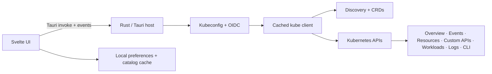

  

<h1 align="center">Kuberniva</h1>

  <strong>Kubernetes, in focus.</strong> 
  A fast, native desktop workspace for people who operate many Kubernetes clusters.

  
  
  
  
  

Kuberniva is an open-source, local-first Kubernetes desktop app. It opens instantly, keeps cluster switching quick, and puts the information that matters (health, workloads, resources, events, logs, and safe operations) into one focused workspace.

## ✨ Highlights

| | What you can do |
| --- | --- |
| ⚡ **Fast launch** | Opens straight to your last workspace with no network wait. Clusters you have opened before appear instantly from a local catalog cache and refresh in the background. |
| 🗂️ **Clusters** | Add kubeconfig files or folders, merge contexts, switch clusters from the top selector, and connect lazily only when a cluster is opened. |
| 🔐 **Authentication** | Use OIDC `exec`, OIDC auth-provider, bearer-token, and client-certificate kubeconfigs. |
| 🛡️ **Authorization** | Respect Kubernetes RBAC per cluster, namespace, API, object, verb, and subresource; hide unavailable APIs and keep read-only identities free of mutation controls. |
| ⭐ **Shortcuts** | Pin up to 10 clusters, rename their shortcuts, and keep them across restarts. |
| 📊 **Overview** | See cluster-wide CPU, memory, and node storage totals first, then select any node for its capacity, allocation, network, and live usage. |
| 🛎️ **Events** | Browse recent Kubernetes Events with warning/normal filters and search. |
| 🧭 **Resources** | Start from a searchable directory of every API type, grouped by Configuration, Access Control, Network, Storage, and Cluster, with your recently opened types on top. Custom APIs have their own directory, grouped by API group. |
| 🚀 **Workloads** | Switch between Deployments, StatefulSets, DaemonSets, Jobs, CronJobs, Pods, and other workload types with one click. Compact, single-line tables show status, readiness, restarts, CPU, and memory at a glance. |
| 📝 **Editors** | Edit ConfigMaps and Secrets as key/value data, reveal Secret values on demand, edit YAML, and view certificate expiry. |
| 📜 **Logs & exec** | Switch between sibling Pods' logs, pick containers, search, copy, or download output, and open a shell in any container. |
| ⌨️ **CLI** | A built-in terminal bound to the active cluster and namespace, with live streaming output. See the CLI section below. |
| 🎨 **Workspace** | Warm ivory light theme and charcoal dark theme, a collapsible sidebar, adjustable interface size, and persistent cluster context. |

## ⌨️ CLI

Open the terminal from **CLI** in the status bar. `kubectl` and `helm` automatically receive the active kubeconfig, context, and namespace, so `get pods` just works.

- **Live output:** output streams as it arrives, so `kubectl logs -f` and `kubectl get pods -w` work.
- **Stop anytime:** use **Stop** or <kbd>Ctrl</kbd>+<kbd>C</kbd> to end the command and everything it started.
- **Any namespace:** add `-n other` or `-A` to look outside the selected namespace. The cluster context stays locked to prevent accidents.
- **Shortcuts:** <kbd>↑</kbd>/<kbd>↓</kbd> for history (kept across restarts), <kbd>Ctrl</kbd>+<kbd>L</kbd> or `clear` to clear, and <kbd>Shift</kbd>+<kbd>Enter</kbd> for a new line.
- **Extras:** copy all output, expand the terminal, and run common commands with one click.

## 📦 Install

Download the latest `.dmg` from [Releases](https://github.com/velqa/Kuberniva/releases), open it, and drag **Kuberniva** into **Applications**. Builds target Apple Silicon Macs.

macOS blocks the first launch?

Current builds are not yet notarized by Apple. Open the app once, then go to **System Settings → Privacy & Security** and choose **Open Anyway**. Alternatively:

~~~bash
xattr -cr /Applications/Kuberniva.app
~~~

Each user adds their own kubeconfig sources after installation.

## 🏗️ Architecture

Kuberniva has two small layers:

- **Svelte 5 + TypeScript:** renders the workspace and owns navigation, selection, editors, sessions, and local preferences.
- **Tauri 2 + Rust:** parses kubeconfigs, runs OIDC authentication, discovers APIs and CRDs, talks to Kubernetes, streams logs and CLI output, and executes context-bound commands.

Kuberniva reads kubeconfig metadata locally, then creates and caches a Kubernetes client only for the selected context. Cluster sessions, namespaces, sidebar state, favorites, recent resource types, CLI history, and API catalogs are stored locally. No proxy service is required.

## 🚀 Run from source

Requirements: Node.js, npm, Rust, and macOS for the native desktop build.

~~~bash
npm install
npm run tauri dev
~~~

For a browser-only UI preview:

~~~bash
npm run dev
~~~

Live Kubernetes connections, OIDC execution, logs, and the CLI require the Tauri desktop host.

## 🔨 Build

Build the Apple Silicon app and disk image:

~~~bash
npm run tauri build -- --bundles app,dmg
~~~

Output lands in `src-tauri/target/release/bundle/` (`macos/Kuberniva.app` and `dmg/`). Developer ID signing and notarization are required for a public distribution that opens without the first-launch step.

## 🧪 Checks

~~~bash
npm run check
npm run build
cargo test --manifest-path src-tauri/Cargo.toml
~~~

## 📁 Repository layout

~~~text
public/                    # In-app logo and static assets
src/App.svelte             # Main Svelte workspace
src/app.css                # UI and responsive design system
src-tauri/src/lib.rs       # Rust/Tauri and Kubernetes integration
src-tauri/icons/           # Native app icons (generated)
src-tauri/icons/source/    # Editable master logo (SVG)
docs/brand/                # README logo and social preview image
LICENSE                    # MIT license
~~~

To change the app icon, edit `src-tauri/icons/source/kuberniva-icon.svg`, export it as a 1024×1024 PNG, and run `npx tauri icon <png>`.

## License

Kuberniva is released under the [MIT License](LICENSE).
